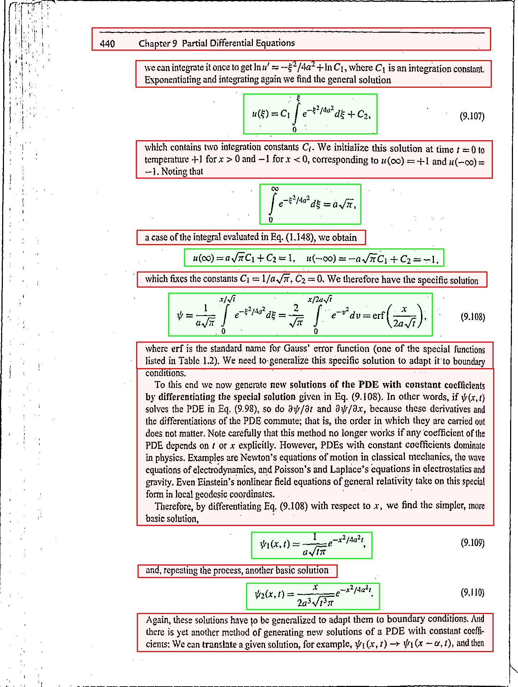

# Transcription of Scientific literature to braille format using OAK-D

Ref: https://www.tensorflow.org/tutorials/images/transfer_learning_with_hub
## Introduction:
---
Textual descriptions found in books can be made available to visually impaired persons in the form of audio output as audio books, as previously stated. In contrast to written material, sophisticated mathematical/Physics equations presented in audio format, such as integral and differential equations, tend to be extremely difficult. This creates a significant barrier for persons with vision impairments to participate in academic research.
To solve this issue, we propose a system that can recognise mathematical equations in a hard copy book and convert them to Nemeth Braille code, which may then be stored or printed if a Braille printer is available.

## Dependencies:
---

- Opencv
- Tensorflow
- Depthai
- latex2nemeth.jar
- Tesseract

All dependencies can be installed using PIP

```Python
cd main
pip install -r requirements.txt
```

## Directory layout
---
```
main
│
├── blob\
│   ├── layout_parser.v1.yolov3_4000_FP16_openvino_2021.3_5shave.blob    
│   ├── layout_parser.v2.yolov3_best_FP16_openvino_2021.3_5shave.blob
│   ├── mobilenet-ssd_openvino_2021.2_6shave.blob
│   ├── ssd_mobilenet_v1_fpn_coco_v5_4442_5_shaves_FP16.blob
│   └── ssd_mobilenet_v1_fpn_coco_v5_4442_5_shaves_FP32.blob
│
├── latex2nemeth\
│   ├── encodings\
│   │   ├── nemeth.json
│   │   └── polytonic.json
│   │
│   ├── examples\
│   │   ├── mathpics.tex
│   │   ├── mathtest.tex
│   │   └── nemeth.json
│   │
│   ├── gpl-3.0.txt
│   ├── latex2nemeth
│   ├── latex2nemeth-v1.0.2.jar
│   └── README
│
├── tesseract-ocr\
│
├── braille_map.json           #json file for mapping text to braille text
├── content_to_braille.py      #Pyscript to convert text and image content to braille
├── image_to_content.py        #pyscript to convert image to Latex
├── layout_parser.py          
├── main.py
├── mathpix.py                 #Pyscript to convert convert image to latex through mathpix
├── preprocess_page.py         
├── process_boundingbox.py
├── speech.py
├── temp.tex
├── temp0.nemeth
└── template.aux
```

## Image collection for Training
---

`Images to train the model was created from the images taken from the Physics and Maths books [Automated Python script](https: book links)`

## Preprocessing of image
---
>Preprocessing of the captured image from the camera


## Instruction to set physical setup
---
>Sample setup is shown


>1. OAK-D is place in the camera holder and connected to the host pc
>2. The holder is firmly attached to a table and Raised to 40cm from book
>3. Etc if any

## Training dataset
1. loren ipsum.
   - lorem ipsum
     - loremipsum 
     - 
2. Model was trained using
   [Transfer Learning of Tensorflow Mobilenet V2 image classification](https://tfhub.dev/s?module-type=image-classification&q=tf2) model
   
## Training dataset
---
Details | - 
--- | --- 
**Type** | Images from Physics and Science books
**Training set** | #### images
**Testing set** | ### images
**Image size** | (300 x 300)
**No. of Classes 5 classes** | Text, Equation, Background
**Dataset** | [Click Here](if we wish to add our dataset)

## Performance metrics of YOLOV3 model

| Model |Trained Images| Input size | Accuracy| mAP | 
| --- | --- |--- | --- |--- |
|YOLOV3|3000| 300x300| ##.##% | ## |


## To run the model
---

```Python
cd main
python main.py
```
## Sample inference from the model
---
Consider the following image:

Text is highlighted in the Red
Math expressions are highlighted in green



## Output from the model
---
>Text portion of the book is dictated upon user instruction 
>Braille format of each page read is stored as .nemeth file in the /main directory which canbe printed using the Braille printer
